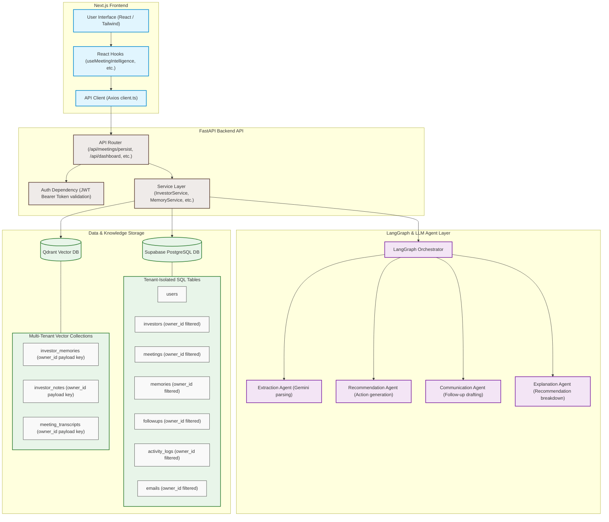

# FounderOS AI

FounderOS AI is an AI-powered fundraising assistant that helps startup founders analyze investor meetings, manage relationships, generate follow-ups, and discover suitable investors.

---

## Architecture Diagram

Here is a detailed representation of the system architecture, detailing data flow from the Next.js frontend to FastAPI backend service layers, LangGraph AI agent execution, and isolated databases:



---

## Features

- **AI Meeting Intelligence**: Automatically parse and extract key summaries, objections, queries, and action items from uploaded investor meeting transcripts.
- **Investor Matchmaking**: Grade alignment and suitability scores using semantic vectors based on investor location, typical checks, preferences, and sectors.
- **Relationship Memory**: Save objection/concern histories, relationship status updates, and durable investor preferences.
- **Follow-up Email Generator**: Auto-compile professional follow-up draft responses using context gathered from meeting summaries.
- **Founder Dashboard**: Real-time insights, priority scores, upcoming meetings lists, and metrics detailing pending follow-ups.
- **Fundraising Readiness Insights**: Structured breakdown explaining matched recommendations to improve success.

---

## Tech Stack

### Frontend
- **Framework**: Next.js
- **UI Logic**: React
- **Type Safety**: TypeScript
- **Styling**: Tailwind CSS

### Backend
- **Framework**: FastAPI (Python)
- **Database ORM**: SQLAlchemy

### Database Layer
- **SQL DB**: Supabase (PostgreSQL)
- **Vector DB**: Qdrant Vector Cloud

### AI Models & Agents
- **Orchestration**: LangGraph
- **Language Models**: Google Gemini 2.5 Flash / Pro (via google-genai)

---

## Project Structure

```text
FounderOS/
├── frontend/     # Next.js Application and React UI Components
└── backend/      # FastAPI REST Application, Services and LangGraph Agents
```

---

## Installation

### Clone the repository
```bash
git clone <repository-url>
cd FounderOS
```

### Install Frontend Dependencies
```bash
cd frontend
npm install
```

### Install Backend Dependencies
```bash
cd ../backend
pip install -r requirements.txt
```

---

## Environment Variables

Create `.env` files in both directories based on the templates below (do not expose private secrets).

### Frontend Configuration
Create `frontend/.env` with the following parameters:
```env
NEXT_PUBLIC_SUPABASE_URL=your-supabase-project-url
NEXT_PUBLIC_SUPABASE_ANON_KEY=your-supabase-anon-key
NEXT_PUBLIC_API_URL=http://localhost:8000
```

### Backend Configuration
Create `backend/.env` with the following parameters:
```env
GEMINI_API_KEY=your-gemini-developer-api-key
SUPABASE_URL=your-supabase-db-url
SUPABASE_SERVICE_ROLE_KEY=your-supabase-service-role-key
QDRANT_URL=your-qdrant-cloud-cluster-endpoint
QDRANT_API_KEY=your-qdrant-read-write-api-key
```

---

## Running the Project

### Start Frontend Application
```bash
cd frontend
npm run dev
```

### Start Backend Service
```bash
cd backend
uvicorn main:app --reload
```
